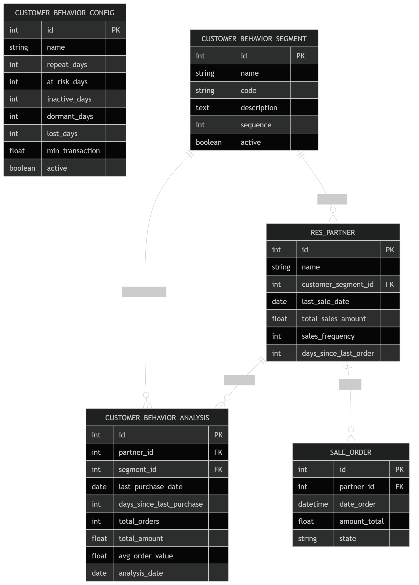

# Odoo Module: Sales Customer Behavior Segmentation

## Overview

This module provides customer segmentation based on purchasing behavior in the Sales module.

It analyzes customer transaction history and classifies them into behavior segments such as:

- Repeat Customer
- At Risk Customer
- Inactive Customer
- Dormant Customer
- Lost Customer
- Reactivated Customer

The module allows configurable time thresholds and transaction parameters to determine customer behavior.

---

# Objectives

- Improve sales analysis
- Detect customer churn early
- Identify loyal customers
- Support retention strategies
- Provide customer lifecycle insights

---

# Module Name

sales_customer_behavior

---

# Dependencies

Required modules:

- sale
- contacts
- crm

Optional:

- sale_management

---

# Customer Segments

| Segment | Description |
|-------|-------------|
| Repeat | Customers who continue purchasing regularly |
| At Risk | Customers who start decreasing purchase frequency |
| Inactive | Customers who have stopped purchasing for a while |
| Dormant | Customers inactive for a long period |
| Lost | Customers considered churned |
| Reactivated | Previously inactive customers who returned |

---

# Configuration

Menu:

Sales → Configuration → Customer Behavior

Users can configure:

- Repeat Days
- At Risk Days
- Inactive Days
- Dormant Days
- Lost Days
- Minimum Transaction Amount

Example configuration:

| Segment | Days |
|------|------|
| Repeat | <= 30 |
| At Risk | 31 - 60 |
| Inactive | 61 - 90 |
| Dormant | 91 - 180 |
| Lost | > 180 |

---

# Data Sources

The module analyzes data from:

sale.order

Conditions:

- state = 'sale'

Metrics calculated:

- Last Purchase Date
- Days Since Last Purchase
- Total Orders
- Total Revenue
- Average Order Value

---

# Analysis Model

Model:

customer_behavior_analysis

Stores computed metrics for each customer.

---

# Automation

A scheduled action runs periodically:

Daily Customer Behavior Analysis

Function:

compute_customer_behavior()

This job recalculates the customer segment.

---

# Sales Integration

Customer segmentation appears in:

Sales → Customers

Additional fields:

- Customer Segment
- Last Purchase Date
- Total Sales Amount
- Sales Frequency

---

# Reporting

Reports available:

- Customer Distribution by Segment
- Revenue Contribution by Segment
- Customer Lifecycle Analysis

Pivot and graph views are supported.

---

# KPI Supported

Customer Retention Rate
